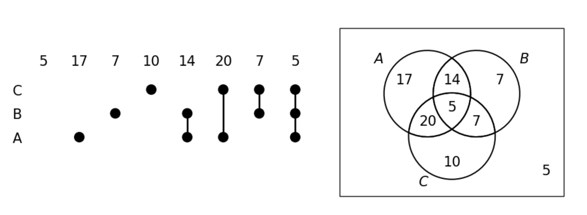

# Assignment 02

Silahkan memilih dua problem berikut untuk diselesaikan.

## Problem 1 (40 poin)

Tentukan apakah pernyataan berikut benar atau salah dan berikan alasannya

<ol type="a">
<li>

$\{\} \in \big\{ \{\} \big\}$
<li>

$\{\} \in \Big\{\{\}, \big\{ \{\} \big\}\Big\}$
<li>

$\big\{ \{ \} \big\} \in \big\{ \{ \} \big\}$
<li>

$\big\{ \{ \}\big\} \in \Big\{ \big\{ \{ \} \big\} \Big\}$
<li>

$\big\{ \{ \} \big\} \subset \Big\{ \{\}, \big\{ \{ \} \big\}\Big\}$
<li>

$\Big\{\big\{ \{ \} \big\} \Big\} \subset \Big\{\{\}, \big\{ \{\} \big\}\Big\}$
<li>

$\Big\{\big\{ \{ \} \big\} \Big\} \subset \Big\{\big\{ \{ \} \big\}, 
  \big\{ \{ \} \big\}\Big\}$
</ol>

## Problem 2 (50 poin)

Untuk menyatakan ilustrasi irisan dan gabungan lebih dari 6 buah himpunan, 
kita tidak dapat lagi dapat menggunakan Diagram Venn. 
Dikenal cara lain yang disebut _UpSet plot_ (lihat lebih lengkap [disini](https://en.wikipedia.org/wiki/UpSet_plot)). 
Secara garis besar diilustrasikan sebagai berikut untuk irisan dan gabungan
dari 3 buah himpunan

Diberikan 7 buah himpunan sebagai berikut, 

- $A = \{0, 0, 0, 0, 1, 0, 0\}$
- $B = \{1, 1, 0, 1, 1, 1, 0\}$
- $C = \{1, 1, 1, 0, 0, 0, 0, 0, 1, 1, 1\}$
- $D = \{1, 1, 0, 1, 0, 1, 0, 0, 0, 1, 0\}$
- $E = \{0, 0, 1, 0, 0, 0, 1, 1, 0, 1, 0, 1, 1, 1, 0, 1, 0, 1, 1\}$
- $F = \{0, 0, 0, 0, 0, 1, 0, 0, 1, 1, 1, 1, 0, 0\}$
- $G = \{1, 1, 0, 0, 1, 1, 1\}$

gambarkan _UpSet plot_ untuk himpunan-himpunan di atas.

## Problem 3 (30 poin)

Diberikan definisi fungsi komposisi sebagai berikut:   
Misalkan $g$ merupakan suatu fungsi dari himpunan $A$ ke himpunan $B$, dan 
misalkan $f$ merupakan suatu fungsi dari himpunan $B$ ke himpunan $C$. 
**Fungsi komposisi** dari fungsi $f$ dan $g$, yang dinotasikan 
$f \circ g$ untuk setiap $a \in A$, adalah fungsi dari $A$ ke $C$
yang didefinisikan sebagai
$$
  (f \circ g)(a) = f(g(a))
$$

Jika diberikan $f(x) = x^2 + 1$ dan $g(x) = x + 2$, yang mana kedua fungsi
ini memiliki domain $\mathbb{R}$ dan co-domain $\mathbb{R}$, carilah bentuk
fungsi $f \circ g$ dan $g \circ f$.

## Problem 4 (40 poin)
Matriks nol-satu merupakan suatu matriks yang hanya terdiri dari bilangan 
0 dan 1. Diberikan dua buah matriks nol-satu $A = [a_{i,j}]$ dan 
$B = [b_{i, j}]$ berukuran masing-masing $m \times n$, kita dapat 
mendefinisikan operasi _join_ dan _meet_ untuk dua matriks tersebut.

Hasil _join_ antara matriks $A$ dan $B$ di atas, yang dinotasikan 
$A \vee B$, adalah matriks nol-satu
yang bilangannya pada posisi $(i, j)$ bernilai $a_{i, j} \vee b_{i, j}$.

Hasil _meet_ antara matriks $A$ dan $B$ di atas, yang dinotasikan 
$A \wedge B$, adalah matriks nol-satu
yang bilangannya pada posisi $(i, j)$ bernilai $a_{i, j} \wedge b_{i, j}$.

Sedangkan definisi operator $\vee$ dan $\wedge$ untuk 
dua bilangan $b_1 \in \{0, 1\}$ dan $b_2 \in \{0, 1\}$, 
diberikan oleh 
$$
  b_1 \wedge b_2 = 
  \begin{cases}
    1 \quad \text{jika } b_1 = b_2 = 1 \\
    0 \quad \text{selainnya}
  \end{cases}
$$
dan 
$$
  b_1 \vee b_2 =
  \begin{cases}
    1 \quad \text{jika } b_1 = 1 \text{ atau } b_2 = 1 \\
    0 \quad \text{selainnya}
  \end{cases}
$$

Berikutnya kita mendefinisikan perkalian Boolean, yang dinotasikan 
$A \odot B$, sebagai suatu matriks nol-satu yang bilangannya pada posisi
$(i, j)$ adalah
$$
  c_{i, j} = (a_{i, 1} \wedge b_{1, j}) \vee (a_{i, 2} \wedge b_{2, j})
    \vee \cdots \vee (a_{i, k} \wedge b_{k, j})
$$
[_Note_: ingat perkalian Boolean ini mirip seperti definisi perkalian matriks
seperti biasanya, namun disini bilangannya menggunakan 0 dan 1 saja dan operator
penjumlahan diganti $\vee$, sedangkan operator perkalian diganti $\wedge$]

Jika diberikan 
$$
  A = \begin{pmatrix}
      1 & 0 & 1 \\ 1 & 1 & 0 \\ 0 & 0 & 1 
    \end{pmatrix}, \quad 
  B = \begin{pmatrix}
      0 & 1 & 1 \\ 1 & 0 & 1 \\ 1 & 0 & 1
    \end{pmatrix}
$$
Carilah
<ol type="a">
<li>

$A \vee B$
<li>

$A \wedge B$
<li>

$A \odot B$
</ol>

## Problem 5 (50 poin)

Suatu matriks persegi $A$ berukuran $n\times n$ apabila dikalikan dengan suatu matriks persegi $B$ berukuran $n \times n$
menghasilkan matriks identitas $\mathbb{I}_{n\times n}$, 
maka matriks $B$ disebut invers dari matriks $A$, 
atau dapat ditulis $B = A^{-1}$. 
Jika diberikan matriks $A$ sebagai berikut
$$
  A = \begin{pmatrix}
        2 & 3 & -1 \\
        1 & 2 & 1 \\
        -1 & -1 & 3
      \end{pmatrix}
$$
Tentukan $A^{-1}$.
